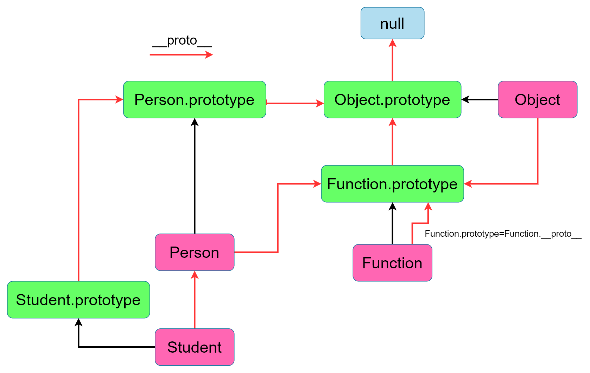

## 原型鍊關係圖(包含繼承關係)

```js
class Person{
    constructor(name,age){
     this.name=name
     this.age=age   
    }
    log(){
        console.log('log')
    }
}

class Student extends Person{
    constructor(name,age,level){
        super(name,age)
        this.level=level
    }
    say(){
        console.log('say')
    }
}
```
關係圖

* * *
以下皆為相等關係
```js
Student.__proto__ === Person //true
Student.propotype.__proto__ === Person.prototype 

Person.__proto__ === Function.prototype     
Person.prototype.__proto__ === Object.prototype 

Function.prototype === Function.__proto__ 
Function.prototype.__proto__ === Object.prototype 
Function.__proto__.__proto__ === Object.prototype 

Object.__proto__ === Function.prototype 
Object.prototype.__proto__ === null  

```